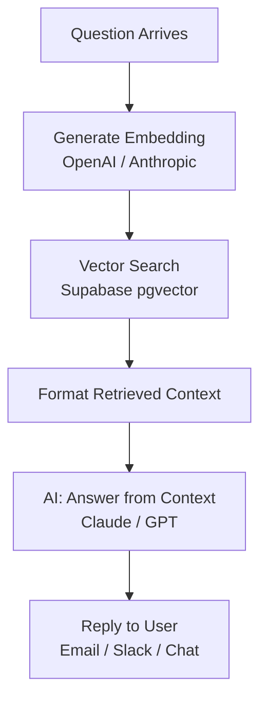
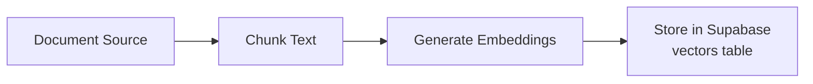
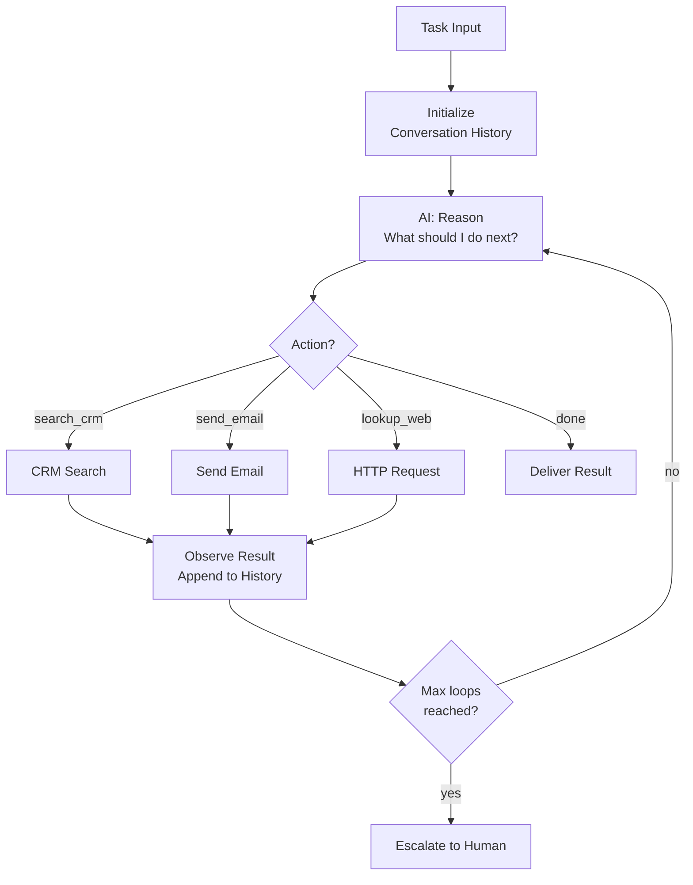
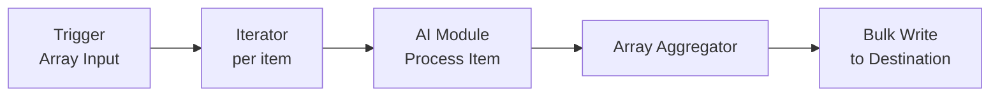

# Patterns 5–7: Advanced AI Agent Patterns

## Pattern 5: Retrieval-Augmented Generator (RAG)

**Use for:** FAQ bots, knowledge-base Q&A, customer support, research assistants.

**Module sequence:** Trigger → Embed question → Vector search → Format context → AI answer → Reply

**Mermaid diagram:**


**Prompt template:**
```
System: Answer ONLY based on the provided context.
If the answer is not in the context, say "I don't have that information." Do not make up facts.

User: Context: {{retrieved_chunks}}
Question: {{user_question}}
```

**Wiring notes:**
- Requires Supabase with pgvector extension enabled
- Requires a separate ingestion scenario to populate the vector store
- Retrieve top 3–5 chunks, filter by cosine similarity > 0.7

**Prerequisite: Knowledge Base Ingestion scenario (build first)**


---

## Pattern 6: ReAct Loop

**Use for:** Multi-step research tasks, autonomous scheduling, complex problem solving.

**ReAct = Reason + Act**: AI reasons, acts (calls a tool), observes result, reasons again.

**Module sequence:** Trigger → Initialize history → AI decide next action → Router → Tool → Collect result → Loop → AI outputs done → Deliver result

**Mermaid diagram:**


**Wiring notes:**
- Implement loop with Make.com Repeater or recursive webhook call
- Set hard max iterations (default: 10) to prevent infinite loops
- Store history in Data Store keyed by session ID
- Cost warning: ReAct loops can use 10–50+ ops per task

---

## Pattern 7: Batch AI Processor

**Use for:** Processing lists — emails, rows, support tickets, products.

**Module sequence:** Trigger (array) → Iterator → AI process each item → Array Aggregator → Bulk write

**Mermaid diagram:**


**Wiring notes:**
- Add rate limiting via Sleep module if AI provider has low RPM limit
- Log failures per item — do not abort the whole batch for one bad item
- Include item index in each AI call for traceability
