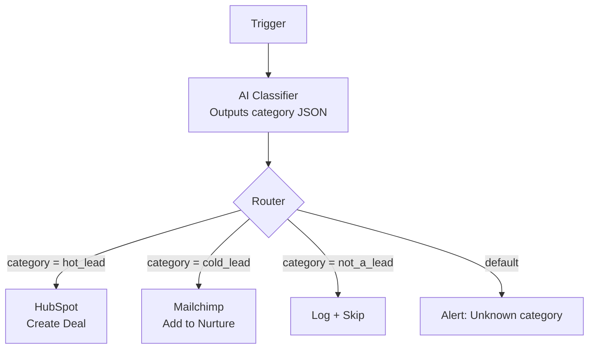
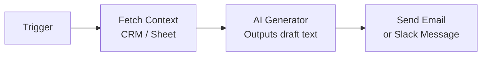
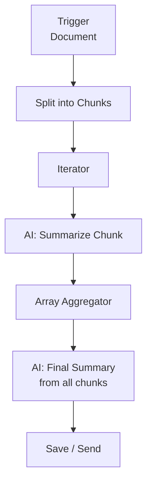
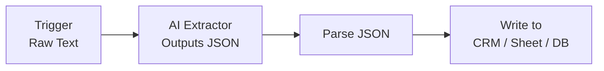

# Patterns 1–4: Basic AI Agent Patterns

## Pattern 1: Classify-and-Route

**Use for:** Triage, lead scoring, ticket routing, spam detection, sentiment analysis.

**Module sequence:** Trigger → AI Classifier → Router → Branch actions → Default/log

**Prompt:** `System: Lead classifier. Respond ONLY with valid JSON.`
`User: Name/Email/Message → {"category":"hot_lead"|"cold_lead"|"not_a_lead","confidence":0.0–1.0,"reason":"one sentence"}`

**Wiring:** Parse AI output with JSON > Parse JSON before routing. Always add a default branch.

---

## Pattern 2: Single-Shot Generator

**Use for:** Email drafts, copy generation, reply suggestions, content creation.

**Module sequence:** Trigger → (Optional) Fetch context → AI Generator → Action

**Prompt:** `System: Professional email writer. Plain text only.`
`User: Lead name/company/last note → write a follow-up to schedule a discovery call.`

**Wiring:** Map AI output directly to email body. Add character limit if downstream has size constraints.

---

## Pattern 3: Chunk-and-Summarize

**Use for:** Long document processing, transcript summarization, report generation.

**Module sequence:** Trigger → Text splitter → Iterator → AI summarize chunk → Array Aggregator → AI final summary → Action

**Wiring:** Max chunk size ~2000 words. Log chunk count and total tokens for cost tracking.

---

## Pattern 4: Structured Extractor

**Use for:** Parsing emails, extracting invoice data, pulling fields from documents.

**Module sequence:** Trigger → AI extract to JSON schema → Parse JSON → Write to destination

**Prompt:** `System: Extract structured data. Respond ONLY with valid JSON. If field not found, use null.`
Include schema with required fields (invoice_number, vendor_name, total_amount, currency, due_date).

**Wiring:** Validate JSON parse success before writing. Add error route → human review queue for failures.
