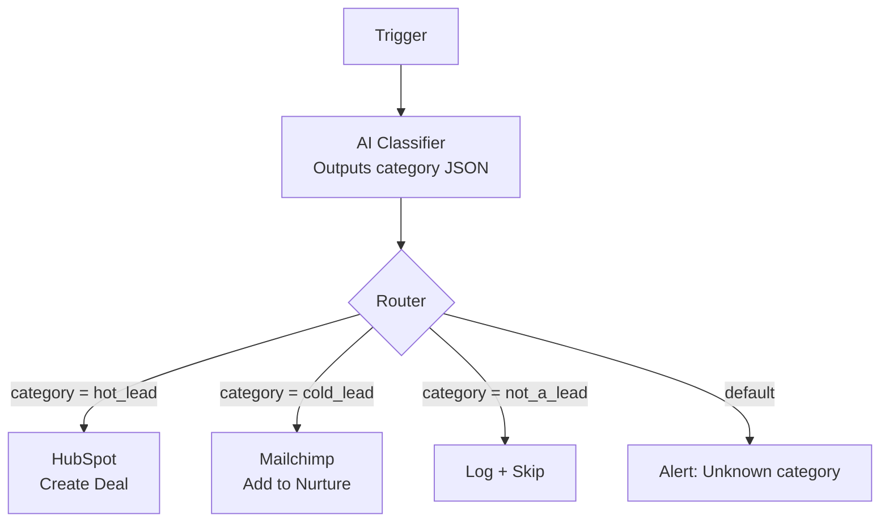
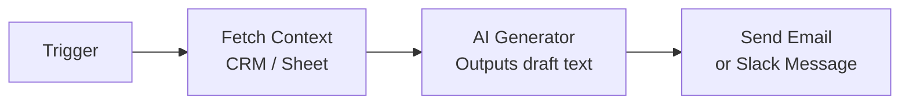
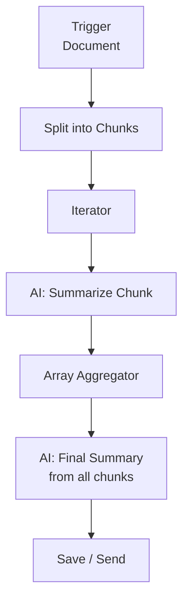
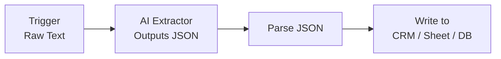
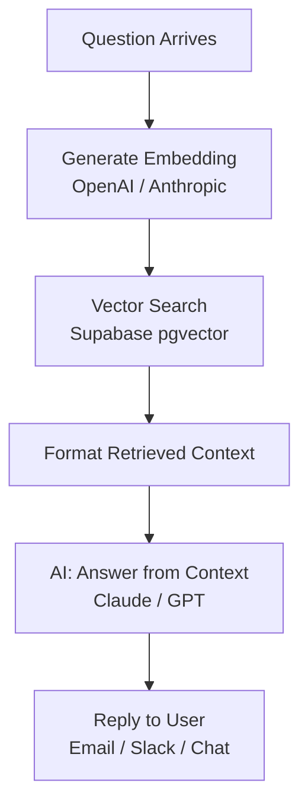
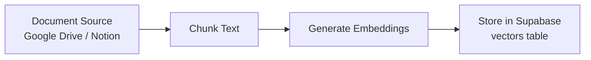
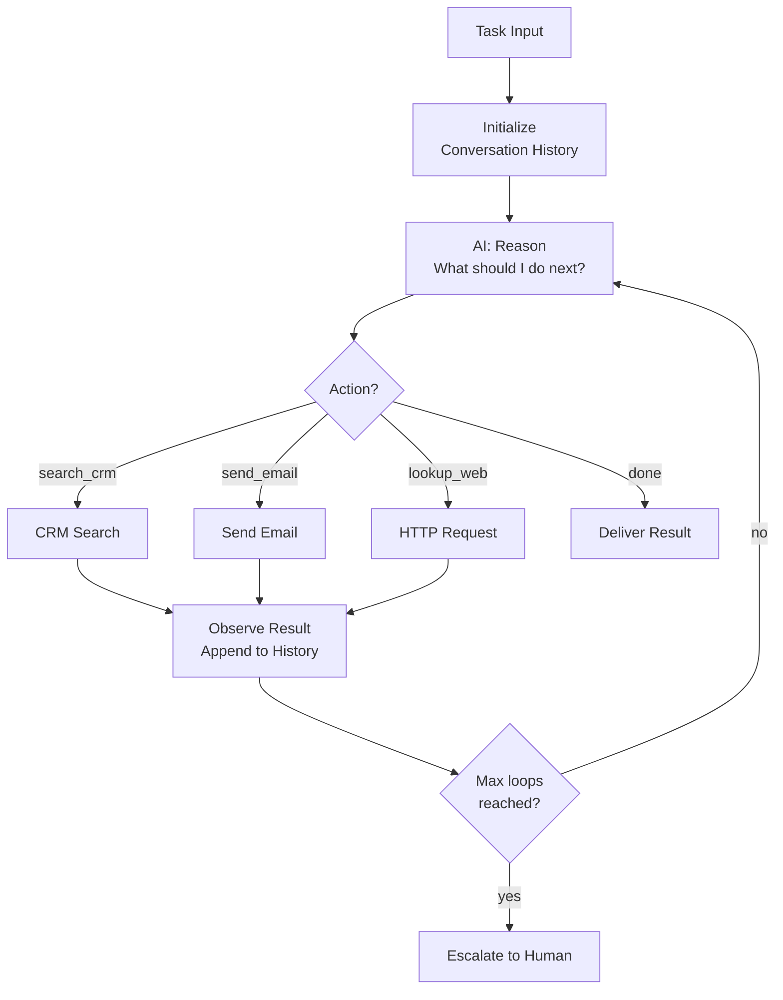
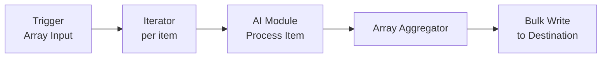

# Skill: agent-pattern-library

Provides battle-tested Make.com AI agent patterns.

Do not design from scratch when a proven pattern exists.
Match the task type to a pattern, load it, and adapt the specifics.

---

## Pattern Index

| Task type | Pattern | Complexity | Ops/run estimate |
|-----------|---------|------------|-----------------|
| Classifier / Router | [Pattern 1: Classify-and-Route](#pattern-1) | Low | 3–5 |
| Generator | [Pattern 2: Single-Shot Generator](#pattern-2) | Low | 2–3 |
| Summarizer | [Pattern 3: Chunk-and-Summarize](#pattern-3) | Medium | 4–8 |
| Extractor | [Pattern 4: Structured Extractor](#pattern-4) | Low | 2–3 |
| RAG (search + answer) | [Pattern 5: Retrieval-Augmented Generator](#pattern-5) | Medium | 5–10 |
| ReAct agent | [Pattern 6: ReAct Loop](#pattern-6) | High | 10–50+ |
| Batch processor | [Pattern 7: Batch AI Processor](#pattern-7) | Medium | 3 × batch size |

---

## Pattern 1: Classify-and-Route {#pattern-1}

**Use for:** Triage, lead scoring, ticket routing, spam detection, sentiment analysis.

**Module sequence:**
1. Trigger (webhook / watch)
2. AI module — classifier prompt → outputs `{ category: "...", confidence: 0.0–1.0 }`
3. Router — branch on `category` value
4. Branch A → Action A (e.g., HubSpot update "hot_lead")
5. Branch B → Action B (e.g., Send Slack "needs review")
6. Default branch → Log + alert

**Mermaid diagram:**


**Prompt template:**
```
System: You are a lead classifier. Analyze the input and respond ONLY with valid JSON.
Never include explanation text.

User: Classify this contact form submission:
Name: {{name}}
Email: {{email}}
Message: {{message}}
Company: {{company}}

Respond with:
{
  "category": "hot_lead" | "cold_lead" | "not_a_lead",
  "confidence": 0.0–1.0,
  "reason": "one sentence max"
}
```

**Wiring notes:**
- Parse AI output with JSON > Parse JSON module before routing
- Router condition: `{{json.category}} = "hot_lead"`
- Always add a default branch for unexpected categories
- Log the full AI response for debugging

---

## Pattern 2: Single-Shot Generator {#pattern-2}

**Use for:** Email drafts, copy generation, reply suggestions, content creation.

**Module sequence:**
1. Trigger (webhook / form / schedule)
2. (Optional) Fetch context data — CRM, spreadsheet
3. AI module — generator prompt → plain text or JSON
4. Action — send email / Slack / update record

**Mermaid diagram:**


**Prompt template:**
```
System: You are a professional email writer for {company_name}.
Write concise, friendly emails. Plain text only — no markdown.

User: Write a follow-up email for this lead:
Name: {{lead.name}}
Company: {{lead.company}}
Last interaction: {{lead.last_note}}
Goal: Schedule a 30-minute discovery call.
```

**Wiring notes:**
- Map AI output directly to email body field
- Add character/token limit in prompt if downstream has field size constraints
- Consider adding a "review" step via Slack before sending if risk is medium/high

---

## Pattern 3: Chunk-and-Summarize {#pattern-3}

**Use for:** Long document processing, transcript summarization, report generation.

**Module sequence:**
1. Trigger — document arrives (webhook, Google Drive watch, email)
2. Text splitter — split by paragraph or token count (Tools > Text Aggregator or custom)
3. Iterator — loop over chunks
4. AI module — summarize this chunk
5. Array Aggregator — collect all chunk summaries
6. AI module — produce final summary from chunk summaries
7. Action — save or send

**Mermaid diagram:**


**Prompt template (chunk):**
```
System: Summarize the following text in 2–3 sentences. Preserve key facts and figures.

User: {{chunk_text}}
```

**Prompt template (final):**
```
System: You are synthesizing partial summaries into one coherent summary.
Produce 5 bullet points maximum. No repetition.

User: Here are summaries of each section:
{{chunk_summaries}}

Write a final executive summary.
```

**Wiring notes:**
- Use Make.com's built-in `length` function to check if chunking is needed
- Set a max chunk size (~2000 words) to avoid hitting model context limits
- Log chunk count and total tokens for cost tracking

---

## Pattern 4: Structured Extractor {#pattern-4}

**Use for:** Parsing emails, extracting invoice data, pulling fields from documents.

**Module sequence:**
1. Trigger — raw text arrives
2. AI module — extract to JSON schema
3. JSON > Parse JSON — validate and map fields
4. Action — write to CRM, spreadsheet, database

**Mermaid diagram:**


**Prompt template:**
```
System: Extract structured data from the following text.
Respond ONLY with valid JSON matching the schema exactly.
If a field is not found, use null.

Schema:
{
  "invoice_number": string | null,
  "vendor_name": string | null,
  "total_amount": number | null,
  "currency": "CAD" | "USD" | "EUR" | null,
  "due_date": "YYYY-MM-DD" | null,
  "line_items": [{"description": string, "amount": number}]
}

User: {{raw_text}}
```

**Wiring notes:**
- Always validate JSON parse success before writing to destination
- Add error route: if parse fails → send to human review queue
- For high-value extractions (invoices, contracts): add confidence field to prompt

---

## Pattern 5: Retrieval-Augmented Generator (RAG) {#pattern-5}

**Use for:** FAQ bots, knowledge-base Q&A, customer support, research assistants.

**Module sequence:**
1. Trigger — question arrives
2. Embedding module — embed the question
3. Vector search — find relevant chunks in Supabase (pgvector)
4. Format context — concatenate retrieved chunks
5. AI module — answer from context
6. Action — reply

**Mermaid diagram:**


**Prompt template:**
```
System: You are a helpful assistant. Answer ONLY based on the provided context.
If the answer is not in the context, say "I don't have that information."
Do not make up facts.

User: Context:
{{retrieved_chunks}}

Question: {{user_question}}
```

**Wiring notes:**
- Requires Supabase with pgvector extension enabled
- Requires a separate ingestion scenario to populate the vector store
- Similarity threshold: retrieve top 3–5 chunks, filter by cosine similarity > 0.7
- Include source document references in the response when possible

**Prerequisite: Knowledge Base Ingestion scenario (build first)**


---

## Pattern 6: ReAct Loop {#pattern-6}

**Use for:** Multi-step research tasks, autonomous scheduling, complex problem solving.

**ReAct = Reason + Act**: AI reasons about what to do, acts (calls a tool), observes the result, reasons again.

**Module sequence:**
1. Trigger — task arrives with context
2. AI module — decide next action (JSON: `{ "action": "...", "input": "..." }`)
3. Router — route to tool based on `action`
4. Tool execution (CRM search, web lookup, email send, etc.)
5. Collect result → append to conversation history
6. Loop back to step 2 with updated history
7. Exit: AI outputs `{ "action": "done", "result": "..." }`
8. Action — deliver final result

**Mermaid diagram:**


**Prompt template:**
```
System: You are an autonomous agent. At each step, decide what to do next.
Respond ONLY with JSON. Never include explanation text.

Available tools:
- search_crm: {"tool": "search_crm", "query": "search term"}
- send_email: {"tool": "send_email", "to": "...", "subject": "...", "body": "..."}
- done: {"tool": "done", "result": "final answer or summary"}

Conversation so far:
{{history}}

Current task: {{task}}

What do you do next?
```

**Wiring notes:**
- Implement loop with Make.com Repeater module or recursive webhook call
- Set hard max iterations (default: 10) to prevent infinite loops
- Store history in Data Store keyed by session ID
- Cost warning: ReAct loops can use 10–50+ ops per task — show this to user before approving
- Always implement the `done` exit path and a timeout fallback

---

## Pattern 7: Batch AI Processor {#pattern-7}

**Use for:** Processing lists — emails, rows, support tickets, products.

**Module sequence:**
1. Trigger — scheduled or webhook with array input
2. Iterator — loop over items
3. AI module — process each item
4. Array Aggregator — collect results
5. Action — bulk write to destination (spreadsheet, CRM, database)

**Mermaid diagram:**


**Wiring notes:**
- Add rate limiting via Sleep module if AI provider has low RPM limit
- Log failures per item — do not abort the whole batch for one bad item
- Include item index in each AI call for traceability
- Set iterator bundle size to match API rate limits

---

## Pattern Selection Logic

```
IF task = "decide which category" OR "route to team" OR "score"
  → Pattern 1: Classify-and-Route

ELSE IF task = "write" OR "generate" OR "draft" OR "suggest"
  → Pattern 2: Single-Shot Generator

ELSE IF task = "summarize long document" OR "condense"
  → Pattern 3: Chunk-and-Summarize

ELSE IF task = "extract fields" OR "parse" OR "pull data from"
  → Pattern 4: Structured Extractor

ELSE IF task = "answer questions from" OR "FAQ" OR "knowledge base"
  → Pattern 5: RAG

ELSE IF task = "autonomously complete" OR "research and do" OR "multi-step"
  → Pattern 6: ReAct Loop

ELSE IF task = "process a list" OR "batch" OR "run on each row"
  → Pattern 7: Batch Processor
```

---

## Output Contract

Return to calling skill/agent:

```json
{
  "pattern_id": "1|2|3|4|5|6|7",
  "pattern_name": "Classify-and-Route|...",
  "module_sequence": ["Trigger", "AI Module", "..."],
  "prompt_template": {
    "system": "...",
    "user": "..."
  },
  "mermaid_diagram": "flowchart ...",
  "ops_per_run_estimate": 5,
  "wiring_notes": ["..."],
  "prerequisites": ["..."]
}
```
