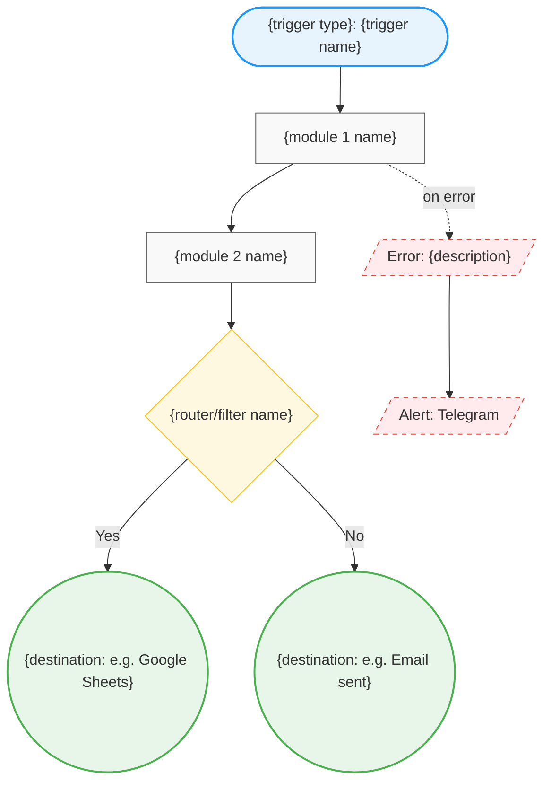

# Skill: diagram-generator

Generates Mermaid flowcharts from parsed scenario data (scenario-reader output).
Called by scenario-reporter and automation-planner.

## Input

Structured scenario representation from scenario-reader skill.

## Output

Valid Mermaid flowchart syntax. Save to `.make/diagrams/{scenario-id}-{timestamp}.md`.

## Mermaid Template



## Node Naming Rules

- Use plain-language names, not Make.com internal module names
- "Google Sheets: Create Row" → "Save to Google Sheets"
- "HTTP: Make a Request" → "Call {API name} API"
- "Telegram Bot: Send Message" → "Send Telegram Alert"
- "Webhooks: Custom Webhook" → "Receive Form Submission"
- "Flow Control: Router" → "Route by {condition}"
- "Flow Control: Iterator" → "For each {item}"

## Shape Reference

| Shape | Use case | Mermaid syntax |
|-------|----------|----------------|
| Stadium `([text])` | Trigger node | `T([...])` |
| Rectangle `[text]` | Process / module | `M1[...]` |
| Diamond `{text}` | Router / filter / decision | `M3{...}` |
| Parallelogram `/text/` | Error / exception node | `E1[/".../"]` |
| Circle `((text))` | End destination | `D1((...))`  |

## Complexity Limit

If scenario has > 20 modules:
- Generate a high-level diagram (main flow only, collapse sub-flows)
- Generate separate detailed diagrams per branch
- Label files: `{id}-overview.md`, `{id}-branch-1.md`, etc.

## Plain Language Notes

After the diagram, add a plain-language key:
```
## What This Diagram Shows

This scenario starts when [trigger description]. It then [step 1], [step 2],
and finally [destination]. If anything fails, [error handling description].
```

## File Format

Save as:
```markdown
# Scenario Diagram: {scenario name}
Generated: {timestamp}
Scenario ID: {id}

## Flow Diagram

```mermaid
{diagram}
```

## What This Diagram Shows
{plain-language description}
```
