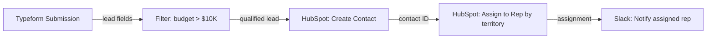

# Blueprint Discovery Steps

Companion to `SKILL.md`. Three-phase interview and extraction process.

## Phase 1 — Conversational Intake

Walk these 8 slots in order. Skip any slot already answered.

1. **Outcome** — "What does *done* look like for this automation? In one breath."
2. **Success signal** — "How do you know it actually worked? What's the proof?"
3. **Trigger** — "What kicks this off? A form, an email, a schedule, a webhook?"
4. **Backward chain** — "Walk me backward: last thing → step before → all the way to the trigger." (Build step list here.)
5. **Data in/out** — For each step: "What data comes in, what goes out? Rough fields."
6. **Tech fit** — "Which Make.com app handles each step? Custom HTTP?" (Capture unknowns.)
7. **Constraints** — "Any blockers? Operations budget, rate limits, privacy rules, missing credentials?"
8. **Validate** — Read back the full flow in 5–7 lines. "Did I get it? What's missing?"

Only after confirmation → Phase 2.

## Phase 2 — Extraction

Silently pull from the conversation:
- Automation outcome + scope (and what's explicitly out of scope)
- Step list (backward chain re-ordered forward)
- Data entities: what enters each step, what exits, rough field names
- Tech fit per step: Make.com app / native module / HTTP / unknown
- Constraints, assumptions, open questions, failure points (feed Phase 3 pre-mortem)

## Phase 3 — Output Bundle

### 1. Automation Brief
Problem · Who it's for · Outcome · Success metrics · In scope · Out of scope ·
Key scenario (trigger → steps → result, 2 sentences).

### 2. Process Map
Steps in order with data in/out. Plain text or mermaid `flowchart LR` if non-trivial.

### 3. Tech Fit

| Step | Make.com App | Module | Notes |
|------|-------------|--------|-------|
| {step} | {app or HTTP} | {module name} | {TBD = Bootstrap blocker} |

### 4. Pre-Mortem Risk Gate (Gary Klein)

**Framing (mandatory):** "It is 6 months from now. This automation has **completely
failed**. List the 3 most specific causes."

Push for specificity — reject vague causes:
- ✗ "API failed" → "Typeform webhook stops firing after 90-day token rotation"
- ✗ "Data was wrong" → "HubSpot dedup uses email, but Typeform collects phone"

**Classify each cause:**

| Category | Meaning | Response |
|---|---|---|
| Tiger — Blocker | Real; prevents activation | Owner + deadline |
| Tiger — Fast Follow | Real; survivable; fix in 30 days | Plan during sprint |
| Tiger — Track | Real; detectable via logs | Add error handler |
| Paper Tiger | Feels risky; no real evidence | Document only |
| Elephant | Unspoken assumption | Name + validate before build |

Ask: "What is being assumed that nobody's said out loud?"
Common elephants: API stays stable · credentials won't expire · data format won't change.

**Go/No-Go checklist** from blocking tigers:
- [ ] {blocker} — Owner: {name} — Due: {date} — Criteria: {what done looks like}

Any unchecked item at sprint start = do not build yet. Verdict: proceed / pause / pivot.

### 5. Next Steps

Smallest thing to validate first (top Elephant or Blocker-Tiger), then build order.

> "Feed this to the factory. Starting kickstart-intake with this blueprint as context."
