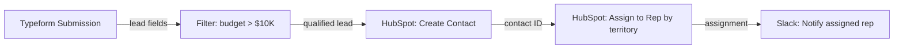

# Discovery to Blueprint — Make.com Edition

## Purpose

The user locked a direction in brainstorm-sharp but doesn't know the steps, the
data shapes, or which Make.com apps to use. This skill asks one question at a time,
extracts the structure, and produces a pre-flight bundle that kickstart-intake can
consume directly — no translation required.

**Never standalone.** Every run ends with a hand-off to kickstart-intake.

## Hard Rules

1. **One question at a time.** Never stack questions.
2. **Conversation first, artifacts last.** No blueprint until intake is done and confirmed.
3. **Reflect, don't interrogate.** Mirror one line after each answer, then ask the next.
4. **No fabrication.** Unknown steps, data shapes, or apps → logged as open questions.
5. **Klein framing for risk.** Pre-mortem uses past tense: "it failed" — never "it might fail".

## Phase 1 — Conversational Intake

Walk these 8 slots in order. Adapt wording to what the user already said.
Skip a slot if already answered.

1. **Outcome** — "What does *done* look like for this automation? In one breath."
2. **Success signal** — "How do you know the automation actually worked? What's the proof?"
3. **Trigger** — "What kicks this off? A form submission, an email, a schedule, a webhook?"
4. **Backward chain** — "Walk me backward: last thing that happens → the step before →
   all the way to the trigger." (Build the step list here.)
5. **Data in/out** — For each step: "What data comes in, what goes out? Rough fields."
6. **Tech fit** — "Which Make.com app handles each step? Or is it a custom HTTP call?"
   (Don't force it — capture unknowns.)
7. **Constraints** — "Any blockers? Operations budget, API rate limits, data privacy rules,
   missing credentials?"
8. **Validate** — Read back the full flow in 5–7 lines. "Did I get it? What's missing?"

Only after confirmation → Phase 2.

## Phase 2 — Extraction

Silently pull from the conversation:
- Automation outcome + scope (and what's explicitly out of scope)
- Step list (backward chain re-ordered forward)
- Data entities: what enters each step, what exits, rough field names
- Tech fit per step: Make.com app / native module / HTTP / unknown
- Constraints, assumptions, open questions, failure points
  (These feed Phase 3 pre-mortem — capture them, don't resolve them here)

## Phase 3 — Output Bundle

Emit these sections clearly:

### 1. Automation Brief

Problem · Who it's for · Outcome · Success metrics · In scope · Out of scope ·
Key scenario (trigger → steps → result, 2 sentences).

### 2. Process Map

Steps in order with data in/out. Plain text or mermaid `flowchart LR` if non-trivial.

Example:


### 3. Tech Fit

| Step | Make.com App | Module | Notes |
|------|-------------|--------|-------|
| {step} | {app or HTTP} | {module name} | {if TBD, flag it} |

Flag any step where the right module is unknown — these become Phase 1 Bootstrap blockers.

### 4. Pre-Mortem Risk Gate (Gary Klein)

**Framing (mandatory — do not skip):**
"It is 6 months from now. This automation was built, activated in Make.com, and has
**completely failed**. Not a glitch — a real failure. Before explaining anything,
list the 3 most specific causes of that failure."

Accept the raw list without comment. Then push for specificity:
- ✗ "API failed" → push for "Typeform webhook stops firing after 90-day token rotation"
- ✗ "Data was wrong" → push for "HubSpot deduplicate field uses email, but Typeform collects phone"
- ✓ Acceptable: names a specific app, rate limit, credential, field, or observable event

**Classify each cause:**

| Category | Meaning | Response |
|---|---|---|
| Tiger — Blocker | Real; would prevent activation | Owner + deadline |
| Tiger — Fast Follow | Real; survivable; fix within 30 days | Plan during sprint |
| Tiger — Track | Real; detectable via execution logs | Add error handler |
| Paper Tiger | Feels risky; no real evidence | Document; spend no sprint time |
| Elephant | Unspoken assumption | Name it; validate before building |

**Surface Elephants explicitly.** Ask:
"What is being assumed that nobody's said out loud? What would embarrass you if
it turned out to be wrong?"

Common Make.com elephants: "the API will stay stable", "credentials won't expire",
"the data format from the source won't change", "someone will monitor the error logs".

**Output a Go/No-Go checklist** from the blocking tigers:
- [ ] {blocker} — Owner: {name} — Due: {date} — Criteria: {what done looks like}

Any unchecked item at sprint start = automation does not get built yet.
Close with verdict: proceed / pause / pivot.

### 5. Next Steps

Smallest thing to validate first (usually the top Elephant or Blocker-Tiger).
Then the suggested build order. End with the hand-off line:

> "Feed this to the factory. Starting kickstart-intake with this blueprint as context."

## Deterministic Gates

### Gate 1 — Direction Check (before Phase 1)

If the user's input has no trigger, no action, no destination → MUST route to `brainstorm-sharp` first.

Say: "Before we map this, let's find the direction. One question at a time."
Then run brainstorm-sharp. After direction locked, Phase 1 begins automatically.

### Gate 2 — Stakes Check (after Phase 3, before hand-off)

Scan the blueprint for high-stakes signals:
- Budget: ">$1K/month operations", "significant cost", "ROI required"
- Commitment: "client contract", "SLA", "production system", "replaces current process"
- Scale: "10,000+ records", "real users", "live environment"
- Business: "revenue-generating", "compliance-required", "mission-critical"

If signals present → MUST offer `council-of-5`:
"This looks high-stakes. Before we start building, should 5 critical voices review
the automation plan? [Yes / Skip — proceed to build]"

User can say Skip — the offer cannot be silently omitted.

## Composition

```
brainstorm-sharp → discovery-to-blueprint → [council-of-5] → kickstart-intake → factory
  (Gate 1: if no                             (Gate 2: if
  direction)                                 high-stakes)
```

This skill never produces standalone output — every run ends with a hand-off line.

## Common Rationalizations

| Rationalization | Reality |
|---|---|
| "The user described the automation — I can skip intake" | Run the backward chain. Every complex automation has hidden steps that emerge only when walking backward. |
| "Pre-mortem is overkill for a simple scenario" | Klein's 15-minute gate has caught more blocking elephants than any design review. Run it. |
| "I'll use hypothetical framing — 'what might fail'" | Klein's mechanism requires past tense. "It has failed" activates pattern recall. Forward framing produces vague worry. |
| "The tech fit is obvious, I don't need to ask" | Unknown modules at this stage become sprint blockers. Surface them now. |
