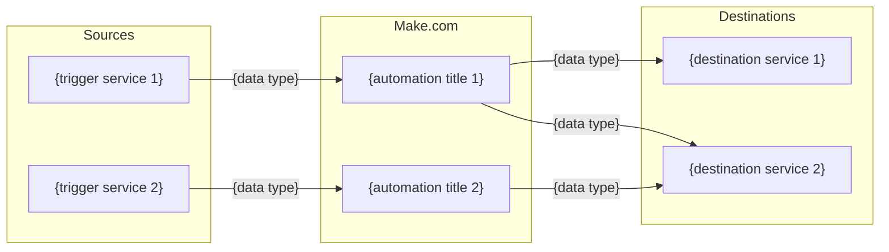

# Intake: Artifacts 3–4

Part of `kickstart-intake`. See `INTAKE-ARTIFACTS.md` for execution order.
For Artifacts 5–6 and the generation summary, see `INTAKE-ARTIFACTS-3.md`.

---

## Artifact 3 — erd.md

````markdown
# Automation Data Flow
**Generated:** {date}

## Integration Map



## Data Objects
| Object | Source | Used By | Destination |
|--------|--------|---------|-------------|
| {data type} | {service} | {automation} | {service} |
````

---

## Artifact 4 — system-design.md

```markdown
# System Design
**Generated:** {date}

## Architecture Overview
{Plain-language description of how the automations work together}

## Trigger Inventory
| Automation | Trigger Type | Source | Schedule / Event |
|------------|-------------|--------|-----------------|
| {title} | Webhook / Poll / Schedule | {service} | {detail} |

## Dependencies
{List inter-scenario dependencies — e.g., auto-001 feeds data to auto-003}

## Error Propagation
{How failures in one automation affect others}
```
