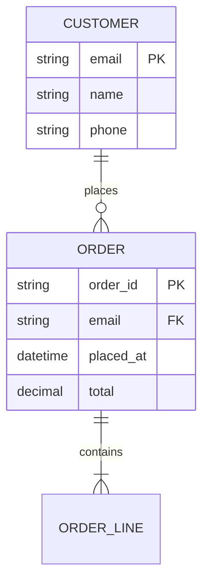

# Intake: Process Map + Entity Model

Part of `kickstart-intake`. See `INTAKE-ARTIFACTS.md` for execution order.

These two artifacts come from the interview, not from Make.com. They describe the
business **as it is today** — which is what makes the automation portfolio arguable
before anything is built.

---

## Interview questions that feed these

Ask these during discovery, before writing either artifact.

**Process (feeds `process-map.md`)**
1. Walk me through it start to finish — who does what, in order?
2. Who else touches it? (each distinct actor becomes a swimlane)
3. Where does someone have to decide something?
4. Which steps are a person doing something by hand?
5. Where does it stall, break, or get done twice?

**Entities (feeds `erd.md`)**
1. What *things* does the business track here? (customer, order, invoice, ticket…)
2. For each: what identifies one uniquely?
3. How do they relate — does one customer have many orders, or many-to-many?
4. Which fields must always be present?
5. Which of these lives in a system you already own (CRM, Sheets, Supabase), and which
   has no home today? *Only the homeless ones become Make data stores.*

---

## Artifact — process-map.md

Path: `.make/context/process-map.md`

Every step tagged `[manual]`, `[system]`, or `[decision]`. `[manual]` steps are the
automation candidates — that tag is the whole point of the diagram.

````markdown
# Process Map — {process name}
**Generated:** {date}
**Scope:** {where the process starts and ends}

## As-Is Flow

```mermaid
flowchart TD
  subgraph {Actor A}
    A1["{step} [manual]"]
    A2{"{decision} [decision]"}
  end
  subgraph {Actor B}
    B1["{step} [system]"]
  end
  A1 --> A2
  A2 -->|"{condition}"| B1
  A2 -->|"{other condition}"| A3["{step} [manual]"]
  B1 --> END(["{outcome}"])
```

## Steps

| # | Actor | Step | Type | Time | Automation candidate |
|---|-------|------|------|------|---------------------|
| 1 | {who} | {what} | manual / system / decision | ~{n} min | Yes → {auto-id} / No → {why not} |

## Pain Points
| Where | What goes wrong | Cost |
|-------|----------------|------|
| {step #} | {failure} | {rework, delay, error rate} |

## Automation Candidates
{Ranked. For each: the step number, the automation id it becomes, and the one-line
reason it is worth automating — volume, error rate, or delay.}
````

Complexity limit: more than 20 steps → produce a high-level map plus one detail map per
sub-process, named `process-map-{sub}.md`.

---

## Artifact — erd.md (entity model half)

Path: `.make/context/erd.md`. This section is appended **below** the integration map in
`INTAKE-ARTIFACTS-2.md` Artifact 3 — one file, two views: what data exists, and how it
moves.

````markdown
## Entity Model



Cardinality: `||--o{` one-to-many optional · `||--|{` one-to-many required ·
`}o--o{` many-to-many.

## Entity Storage

| Entity | System of record | Make data store needed | Key |
|--------|-----------------|----------------------|-----|
| {name} | {CRM / Sheets / Supabase / none today} | Yes / No | {unique key} |

**Rule:** an entity that already has a system of record does **not** get a Make data
store. Duplicating it creates two truths that drift. Make data stores are for state the
automation itself owns — dedupe keys, cursors, run flags, per-item status.
````
